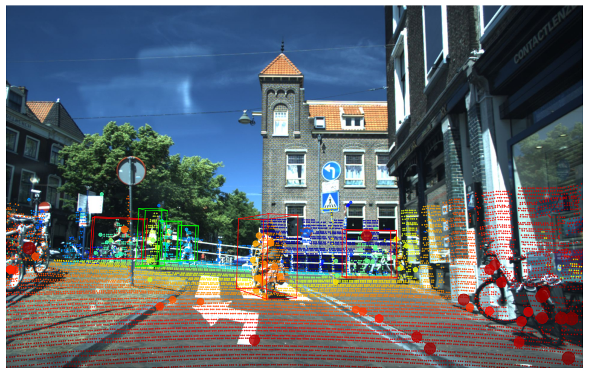
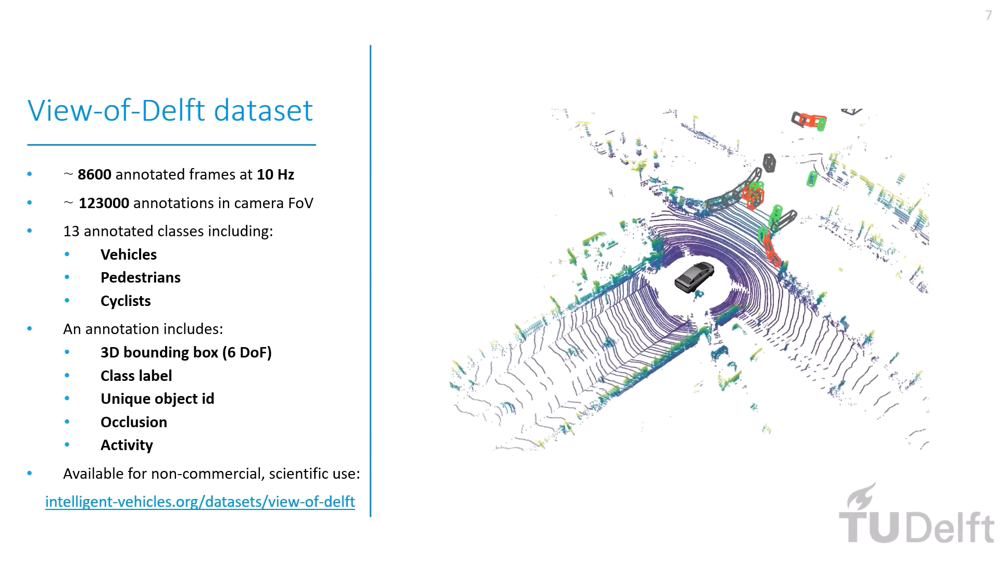

# The View of Delft dataset

This repository shares the documentation and development kit of the View of Delft automotive dataset.

<div align="center">
<figure>

</figure>
<br clear="left"/>
<b>Example frame from our dataset with camera, LiDAR, 3+1D radar, and annotations overlaid.</b>
</div>
<br>
<br>

---

## Overview
- [Introduction](#introduction)
- [Sensors and Data](#sensors-and-data)
- [Annotation](#annotation)
- [Access](#access)
- [Getting Started](#getting-started)
- [Examples and Demo](#examples-and-demos)
- [Citation](#citation)
- [Original paper](https://ieeexplore.ieee.org/document/9699098)
- [Code on Github](https://github.com/tudelft-iv/view-of-delft-dataset)
- [Links](#links)
<br>
<br>

---

## Changelog
[2022-07-11] Added [guidelines](https://github.com/tudelft-iv/view-of-delft-dataset/blob/main/PP-Radar.md) to train PointPillars on the 3+1D Radar point cloud using OpenPCDet.

---

## Introduction

The View-of-Delft (VoD) dataset is a novel automotive dataset containing 8600 frames of synchronized and calibrated 64-layer LiDAR-, (stereo) camera-, and 3+1D radar-data acquired in complex, urban traffic. It consists of more than 123000 3D bounding box annotations, including more than 26000 pedestrian, 10000 cyclist and 26000 car labels.

<div align="center">
<p float="center">


<br />
<b>Example clip from our dataset with sensor data (left), and annotations (right) overlaid.</b>
</p>
</div>

A short introduction video of the dataset can be found here (click the thumbnail below):

<div align="center">
  <a href="https://www.youtube.com/watch?v=R8r3lrkicJ0"></a>
</div>
<br>
<br>

---

## Sensors and data

We recorded the output of the following sensors:

- a ZF FRGen21 3+1D radar (∼13 Hz) mounted behind the front bumper,
- a stereo camera (1936 × 1216 px, ∼30 Hz) mounted on the windshield,
- a Velodyne HDL-64 S3 LIDAR (∼10 Hz) scanner on the roof, and
- the ego vehicle’s odometry (filtered combination of RTK GPS, IMU, and wheel odometry, ∼100 Hz).

All sensors were jointly calibrated. See the figure below for a general overview of the sensor setup.

For details about the sensors, the data streams, and the format of of the provided data, please refer to the [SENSORS and DATA](docs/SENSORS_AND_DATA.md) documentation.

<div align="center">

</div>
<br>
<br>

---

## Annotation

The dataset contains 3D bounding box annotations for 13 road user classes with occlusion, activity, information, along with a track id to follow objects across frames. For more details, please refer to the [Annotation](docs/ANNOTATION.md) documentation.
<br>
<br>

---

## Access

The dataset is made freely available for non-commercial research purposes only. Eligibility to use the dataset is limited to Master- and PhD-students, and staff of academic and non-profit research institutions. Access will be possible to request by filling this form:  

[**Form to request access to the VoD dataset**](https://forms.gle/fFz5EwPb7zqex9kX8)

By requesting access, the researcher agrees to use and handle the data according to the [license](https://intelligent-vehicles.org/datasets/view-of-delft/view-of-delft-dataset-research-use-license). See furthermore our [privacy statement](https://intelligent-vehicles.org/datasets/view-of-delft/privacy-statement).

After validating the researcher’s association to a research institue, we will send an email containing password protected download link(s) of the VoD dataset. Sharing these links and/or the passwords is strictly forbidden (see licence).

In case of questions of problems, please send an email to a.palffy at tudelft.nl.
<br>
<br>

---

## Getting Started

Please refer to the [GETTING_STARTED](docs/GETTING_STARTED.md) manual to learn how to organize the data and start using the development kit, as well as find information regarding evaluation.
<br>
<br>

---

## Examples and Demos

Please refer to this [EXAMPLES](docs/EXAMPLES.md) manual for several examples (Jupyter Notebooks) of how to use the dataset and the development kit, including data loading, fetching and applying transformations, and 2D/3D visualization.
<br>
<br>

---

## License

* TODO the development kit is realeased under the TBD license.
* The dataset can be used by accepting the [Research Use License](https://intelligent-vehicles.org/datasets/view-of-delft/view-of-delft-dataset-research-use-license/).
<br>
<br>

---

## Acknowledgement
* Annotation was done by [understand.ai](https://understand.ai), a subsidiary of DSpace.
* This work was supported by the Dutch Science Foundation NWO-TTW, within the SafeVRU project (nr. 14667).
* During our experiments, we used the [OpenPCDet](https://github.com/open-mmlab/OpenPCDet) library both for training, and for evaluation purposes.
* We thank Ronald Ensing, Balazs Szekeres, and Hidde Boekema for their extensive help developing this development kit.
<br>
<br>

---

## Citation 
If you find the dataset useful in your research, please consider citing it as:

```
@ARTICLE{apalffy2022,
  author={Palffy, Andras and Pool, Ewoud and Baratam, Srimannarayana and Kooij, Julian F. P. and Gavrila, Dariu M.},
  journal={IEEE Robotics and Automation Letters}, 
  title={Multi-Class Road User Detection With 3+1D Radar in the View-of-Delft Dataset}, 
  year={2022},
  volume={7},
  number={2},
  pages={4961-4968},
  doi={10.1109/LRA.2022.3147324}}
```
<br>
<br>

---


## Links
- [Original paper](https://ieeexplore.ieee.org/document/9699098)
- [The paper on Research Gate](https://www.researchgate.net/publication/358328092)
- [Demo video of the dataset](https://youtu.be/R8r3lrkicJ0)
- [Visit our website](https://intelligent-vehicles.org/)
- [Research Use Licence](https://intelligent-vehicles.org/datasets/view-of-delft/view-of-delft-dataset-research-use-license/)


